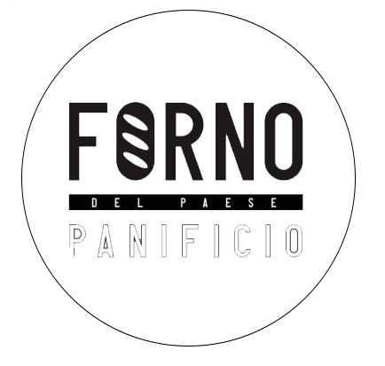

<h1 align="center">Forno del Paese</h1>

<div align="center">

<p>
<p>¡Echa un vistazo al video promocional!</p>
<a href="https://www.youtube.com/watch?v=TCKg9q0gyLY" target="_blank" rel="Forno del Paese">
  
</a>
</div>

## Descripción

Forno del Paese es un emprendimiento de elaboración de productos hechos con masa madre. Tiene variedad de panes de molde, de campo, focaccias y pizzas variadas. Actualmente sus canales de comunicación y venta son Instagram, Facebook y Whatsapp, nuestro E-Commerce apunta a facilitar al usuario la compra y seguimiento posventa de manera ágil, segura y autónoma.

## Instalación

_Estas instrucciones le permitirán obtener una copia del Ecommerce._

_Para clonar el repositorio escribe:_

```
$ git clone https://github.com/No-Country/c13-08-n-php.git
```

### Código del Frontend
Esta APP está desarrollado utilizando React, Vite y Material UI. Para acceder al código del Frontend, ingresa a la carpeta del proyecto y sigue los pasos de su README.md para correr el proyecto de manera local.

```
$ cd frontend
```

### Código del Backend
Esta API es hecha con Laravel, PHP y MySQL. Para acceder al código del Backend, ingresa a la carpeta del proyecto y sigue los pasos de su README.md para correr el proyecto de manera local.

```
$ cd backend
```

### Documentación
Para planificar el desarrollo de este proyecto se documentaron el modelo entidad-relación y la arquitectura utilizada. Puedes ver los documentos importantes dentro de la carpeta _documentation_.

```
$ cd documentation
```

### UX/UI
Este proyecto fue pensado para el uso de cualquier usuario, el trabajo hecho por la integrantes del diseño esta plasmado en el siguiente link disponible en [](https://www.figma.com/file/X39teMoLDx1ezriVebyWV3/Proyecto-No-Country-%3A-c13-08-n-php?type=design&node-id=253-1218&mode=design), accede para ver con detalles el diseño del ecommerce.

## Tecnologías utilizadas

### Tecnología UX/UI 
[](https://www.figma.com/)

### Tecnologías frontend
[](https://reactjs.org/)
[](https://reactrouter.com) [](https://mui.com/) [](https://vitejs.dev/)  

### Tecnologías backend
[](https://www.php.net/) [](https://laravel.com/) [](https://www.mysql.com/) [](https://apache.org/) [](https://www.docker.com/) [](https://www.clever-cloud.com/) [](https://fly.io/) [](https://www.postman.com/) [](https://cloudinary.com/)

## Equipo

*  **Adriana Sánchez** -  [Email](adrievelyn@gmail.com) 

*  **Carolina Flotts** -  [LinkedIn](https://www.linkedin.com/in/carolinalorenaflotts/) 

*  **Diego Omar Bufalari** -  [LinkedIn](https://www.linkedin.com/in/diego-omar-bufalari-8576831b9/) 

*  **Jesus Ruiz** -  [LinkedIn](https://www.linkedin.com/in/jesus-alberto-vasquez-ruiz-developer/) 

*  **Eric Brandan** -  [LinkedIn](https://www.linkedin.com/in/eric-brandan-99a73922b/) 

*  **Ignacio Zolorza** - [LinkedIn](https://www.linkedin.com/in/ignacio-zdev/) 

*  **Maria Ines Godoy** -  [LinkedIn](https://www.linkedin.com/in/mariainesgodoy/) 

*  **Gabriel Mendoza** -  [LinkedIn](https://www.linkedin.com/in/gabriel-mendoza-a1a077227/) 

*  **Lucas Dipasquale** -  [LinkedIn](https://www.linkedin.com/in/lucasdipasquale) 

<h6 align="center">Cohorte 13 - Equipo 08 - PHP - React</h1>